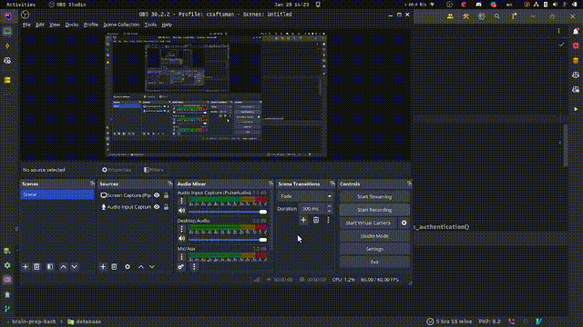

# 🤖 Laravel Migration AI

A Laravel package that uses AI to generate database migrations from plain-language descriptions, simplifying the migration creation process.


## Table of Contents

- [Installation](#installation)
- [Configuration](#configuration)
- [Usage](#usage)
- [Commands](#commands)
- [Example](#Exemple)
- [License](#license)
- [Contributing](#contributing)

## Installation

1. **Install the package via Composer:**

   Run the following command in your Laravel project:

   ```bash
   composer require --dev cedric-lekene/laravel-migration-ai
   ```

2. **Register the Service Provider (if not using auto-discovery):**

   If your Laravel version does not support package auto-discovery, you will need to register the service provider in your `config/app.php` file:

   ```php
   'providers' => [
       // Other Service Providers

       CedricLekene\\LaravelMigrationAI\\LaravelMigrationAIServiceProvider::class,
   ],
   ```

## Configuration

To use the package, you need to set up your environment variables. Add the following keys to your `.env` file:

```
GEMINI_API_KEY=your_gemini_api_key
GEMINI_MODEL=gemini-1.5-flash
```

### Environment Variables

- **GEMINI_API_KEY**: Your API key for [Gemini](https://ai.google.dev/gemini-api/docs/api-key).
- **GEMINI_MODEL**: (Optional) Specify the model used for Gemini (default: `gemini-1.5-flash`).

> **Note:** `GEMINI_API_KEY` must be defined in your environment variables.

## Usage

Once the package is installed and configured, you can generate a migration file using the command below.

## Commands

- **make:migration-ai**: Generate a migration file from a plain-language description.

### Example Command

```bash
php artisan make:migration-ai migration_name description="description about the content of migration"
```
### Example

```bash
php artisan make:migration-ai add_fields_in_users_table description=" Add a new column named 'age'(integer|nullable|default value 0) , 'sexe'(string|nullable), 'phone'(string|nullable)"
```

### Real Output

This command will create a migration file similar to the following:

```php
use Illuminate\Database\Migrations\Migration;
use Illuminate\Database\Schema\Blueprint;
use Illuminate\Support\Facades\Schema;

return new class extends Migration
{
    /**
     * Run the migrations.
     */
    public function up(): void
    {
        Schema::table('users', function (Blueprint $table) {
            $table->integer('age')->nullable()->default(0);
            $table->string('sexe')->nullable();
            $table->string('phone')->nullable();
			
        });
    }

    /**
     * Reverse the migrations.
     */
    public function down(): void
    {
        Schema::table('users', function (Blueprint $table) {
            $table->dropColumn('age');
            $table->dropColumn('sexe');
            $table->dropColumn('phone');
			
        });
    }
}
```


This command will create a migration file based on the provided description.

## License

This project is licensed under the MIT License - see the [LICENSE](LICENSE) file for details.

## Contributing

Contributions are welcome! Please read the [CONTRIBUTING.md](CONTRIBUTING.md) for details on how to contribute to this project.